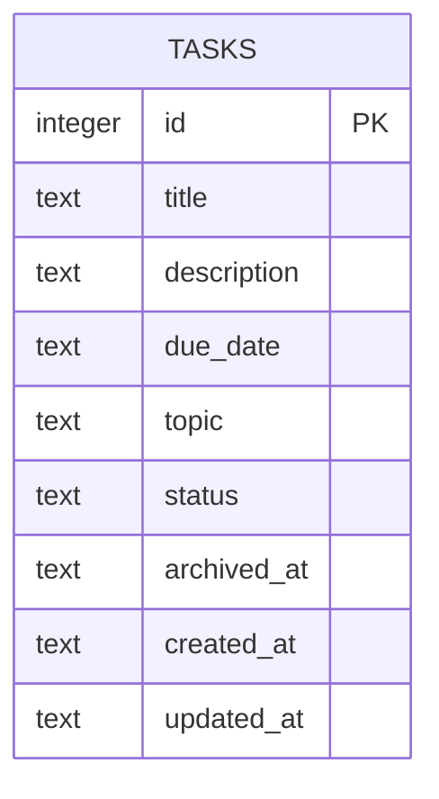

# Database Design

> **Database engine:** SQLite  
> **Schema source:** `migrations/001_create_tasks.sql`  
> **Runtime location:** `data/todo.db` by default

## Purpose

SQLite gives this local-first application durable storage without requiring the user to install or operate a separate database server. The database file stays on the machine running the application, which matches the single-user brief.

## Entity Model

The initial design has one table and therefore no foreign-key relationships. A topic is a required label belonging to a task, not an independently managed object. Keeping it on `tasks` avoids a second table whose only purpose would be to hold duplicate-free strings while still allowing the list to sort by topic.

The migration runner also maintains an internal `schema_migrations` table with a migration filename primary key and an `applied_at` timestamp. It is infrastructure metadata rather than application data and has no relationship to `tasks`.

## `tasks` Table

| Column | SQLite type | Null? | Constraint or default | Purpose |
| --- | --- | --- | --- | --- |
| `id` | `INTEGER` | No | Primary key, auto-generated | Stable task identity |
| `title` | `TEXT` | No | Trimmed value must not be empty | Short task summary |
| `description` | `TEXT` | No | May be an empty string | Longer task detail |
| `due_date` | `TEXT` | No | ISO calendar date, `YYYY-MM-DD` | Date used for sorting and overdue derivation |
| `topic` | `TEXT` | No | Trimmed value must not be empty | User-supplied grouping label |
| `status` | `TEXT` | No | `TODO`, `IN_PROGRESS`, or `COMPLETE` | Fixed workflow state |
| `archived_at` | `TEXT` | Yes | `NULL` for active tasks | UTC timestamp recording when a task was archived |
| `created_at` | `TEXT` | No | UTC timestamp | Audit time for creation |
| `updated_at` | `TEXT` | No | UTC timestamp | Audit time for the latest edit |

## Relationships

There are no relationships between tables in the first schema because only `tasks` exists. Every required field belongs directly to one task:

- A task has exactly one title, description, due date, topic, and status.
- A topic can appear on many task rows, but it is not a foreign key because topics are not created, renamed, or deleted separately.
- Archived and active tasks remain in the same table. Archiving changes `archived_at`; it never moves or deletes a row.

If a later requirement introduced topic management or topic metadata, a `topics` table and a `tasks.topic_id` foreign key would then be justified. That relationship is intentionally outside this lab's scope.

## Business Rules in the Schema

### Fixed statuses

The `status` column has a `CHECK` constraint accepting only:

| Stored value | Display label |
| --- | --- |
| `TODO` | Todo |
| `IN_PROGRESS` | In-Progress |
| `COMPLETE` | Complete |

This protects the data even if a caller bypasses the user interface. **Overdue is not a status** and cannot be written to this column.

### Archive instead of delete

An active task has `archived_at = NULL`. Archiving sets it to a UTC timestamp on the existing row. The application has no task deletion operation, and archived tasks are selected from the same table for the archived view.

### Derived overdue value

The service derives `isOverdue` at read time. A task is overdue when:

1. Its `due_date` is earlier than today's local calendar date.
2. Its status is not `COMPLETE`.
3. It has not been archived.

No `is_overdue` column exists. Storing it would allow the value to become stale when the date changes and would conflict with the rubric.

## Indexes

The migration creates focused indexes for the required views and sorting operations:

| Index | Columns | Reason |
| --- | --- | --- |
| `idx_tasks_archived_at` | `archived_at` | Separates active and archived views efficiently |
| `idx_tasks_topic` | `topic` | Supports sorting by topic |
| `idx_tasks_status` | `status` | Supports sorting by status |
| `idx_tasks_due_date` | `due_date` | Supports ISO date ordering and due-date sorting |

## Connection and Migration Policy

- Foreign-key enforcement is enabled for every connection even though version 1 has no foreign keys.
- The application creates the local `data/` directory when needed.
- The migration is idempotent so a fresh clone and an existing installation follow the same startup path.
- Each applied migration filename is recorded once in `schema_migrations`.
- Tests create a separate temporary SQLite database and remove it after each test suite. Tests never use `data/todo.db`.
- SQL values are bound as parameters. Sort columns are selected only from a fixed allow-list because SQL identifiers cannot be safely passed as ordinary value parameters.

## Synchronization Rule

This document, `migrations/001_create_tasks.sql`, the backend repository row mapping, and `src/shared/task-contracts.ts` are one contract. Any schema change must update all four in the same coherent commit.