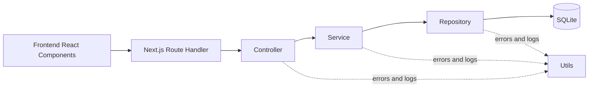
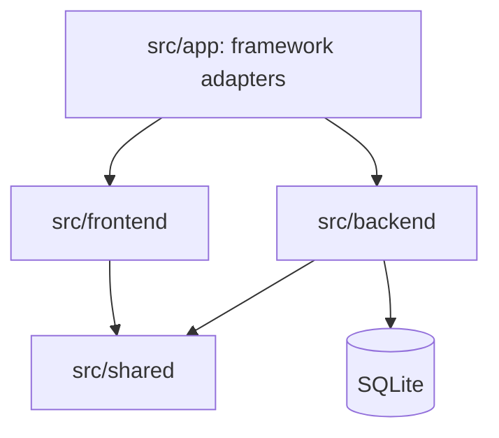

# COMS3011A Lab 1 — Project Plan

> **Project:** Local-first Todo Application  
> **Stack:** Next.js, TypeScript, Node.js, and SQLite  
> **Submission due:** 4 August 2026

## 1. Purpose

This project provides a single-user todo application that runs entirely on the user's computer. It does not require accounts or a hosted service. Tasks are persisted in SQLite so they survive page reloads and application restarts.

The implementation is designed around the lab's marking walkthrough: a clean clone must install and start from the README, all task operations must persist, archived tasks must remain viewable, every required sort must be available, and overdue tasks must be derived and visibly identified.

## 2. Requirements

| Requirement | Design decision | Verification |
| --- | --- | --- |
| Create tasks with title, description, due date, and topic | Validated task form calls the create controller and service | Integration test and manual walkthrough |
| Edit an existing task | Update operation preserves the task ID and writes changes to SQLite | Integration test plus page reload |
| Archive without deleting | `archived_at` is set on the existing task row | Archive test and archived view |
| Three fixed statuses | TypeScript enum-like constants and a database `CHECK` constraint | Validation test and form options |
| Sort by topic, status, and due date | Repository uses an allow-listed sort mapping | Repository tests and list controls |
| Indicate overdue tasks | Service derives `isOverdue` from due date, completion state, and current date | Deterministic overdue tests |
| Persist after restart | SQLite database is stored under the local `data/` directory | Restart walkthrough |
| At least three meaningful tests | Service and repository tests use a temporary database | One documented `npm test` command |
| Required markdown documentation | Dedicated third-party, database, and running guides | Documentation review |
| AI usage transcript | Session decisions and corrections recorded under `docs/ai-usage/` | Submission review |

## 3. Architecture



### Layer responsibilities

| Layer | Purpose | Why it exists |
| --- | --- | --- |
| `frontend` | Contains React components, hooks, client API calls, and presentation types | Makes the browser-facing application visibly separate from backend code |
| `app` | Provides only Next.js pages, layouts, and HTTP route adapters | Keeps framework entry points thin and prevents them from becoming a mixed application layer |
| `backend/controller` | Translates HTTP input into service calls and maps results or errors into HTTP responses | Keeps transport concerns out of business logic |
| `backend/service` | Owns validation and business rules, including fixed statuses, archiving behavior, and overdue derivation | Gives the application one testable source of truth |
| `backend/repository` | Performs parameterized SQLite queries and maps database rows to domain records | Isolates persistence details from business logic |
| `backend/utils` | Provides structured logging and typed application errors | Centralizes diagnostics and consistent error handling |
| `tests` | Exercises services and repositories against temporary SQLite databases | Makes tests deterministic and independent of developer data |

The Next.js files under `src/app/` are deliberately thin composition points. Pages render components imported from `src/frontend/`, and route handlers delegate immediately to controllers imported from `src/backend/`. Controllers do not issue SQL, repositories do not decide business policy, and frontend components do not calculate whether a task is overdue.

### Dependency direction



- `frontend` must never import from `backend` directly. Browser code communicates through `/api/tasks`.
- `backend` must never import React components, hooks, or browser-only APIs.
- `shared` contains only transport-safe contracts needed on both sides; it contains no database or React implementation.
- `app` is the only composition boundary allowed to import both frontend and backend modules.

## 4. Project Structure

```text
Lab1_Todo_App/
├── data/
│   └── README.md                   # Runtime database policy; database files are ignored
├── docs/
│   ├── ai-usage/
│   │   └── TRANSCRIPT.md           # AI prompts, decisions, corrections, and outcomes
│   ├── DATABASE_DESIGN.md          # Tables, constraints, indexes, and relationships
│   ├── PROJECT_PLAN.md             # Architecture and delivery plan
│   ├── RUNNING_IT.md               # Clean-clone install, run, and test commands
│   └── THIRD_PARTY_CODE.md         # Every direct dependency and its justification
├── migrations/
│   └── 001_create_tasks.sql        # Reproducible SQLite schema
├── public/                          # Static browser assets
├── scripts/
│   └── migrate.ts                  # Applies the shipped schema
├── src/
│   ├── app/
│   │   ├── api/tasks/
│   │   │   ├── [id]/route.ts       # Update and archive HTTP endpoints
│   │   │   └── route.ts            # List and create HTTP endpoints
│   │   ├── globals.css
│   │   ├── layout.tsx
│   │   └── page.tsx                 # Renders the frontend application shell
│   ├── frontend/
│   │   ├── components/
│   │   │   ├── layout/              # Header and application shell
│   │   │   ├── tasks/               # Task list, item, form, and empty state
│   │   │   └── ui/                  # Reusable button, field, badge, and dialog
│   │   ├── hooks/                    # Task fetching and form interaction hooks
│   │   ├── lib/
│   │   │   └── task-api.ts          # Typed browser calls to /api/tasks
│   │   ├── styles/                   # Frontend component styles and tokens
│   │   └── types/                    # View models used only by React code
│   ├── backend/
│   │   ├── controller/
│   │   │   └── task-controller.ts   # HTTP-to-service translation
│   │   ├── repository/
│   │   │   └── task-repository.ts   # SQLite task persistence
│   │   ├── service/
│   │   │   └── task-service.ts      # Task business rules
│   │   ├── utils/
│   │   │   ├── app-error.ts         # Typed operational errors
│   │   │   └── logger.ts            # Structured local logging
│   │   └── database.ts              # SQLite connection and migration setup
│   └── shared/
│       └── task-contracts.ts         # Statuses and API-safe task contracts
├── tests/
│   ├── backend/
│   │   ├── helpers/
│   │   │   └── test-database.ts     # Isolated temporary database factory
│   │   ├── repository/
│   │   │   └── task-repository.test.ts
│   │   └── service/
│   │       └── task-service.test.ts
│   └── frontend/
│       └── components/              # Focused interaction tests if required
├── .env.example                     # Documented local settings
├── .gitignore
├── package-lock.json
├── package.json
├── README.md                        # Submission entry point
└── tsconfig.json
```

### Architecture status

| Area | Status | Evidence or next deliverable |
| --- | --- | --- |
| Next.js foundation | Complete | TypeScript App Router scaffold and installed dependencies |
| Frontend/backend separation | Complete | Physical `src/frontend`, `src/backend`, `src/shared`, and thin `src/app` boundaries |
| React component structure | Complete | Tracked `layout`, `tasks`, and `ui` component folders |
| Test structure | Complete | Separate backend and frontend test trees |
| Local data boundary | Complete | Ignored `data/` directory with documented environment override |
| SQLite schema and migration | Not started | Implement `001_create_tasks.sql` and the migration runner |
| Backend task behavior | Not started | Implement contracts, database, repository, service, controller, utils, and routes |
| Todo user interface | Not started | Implement task components, hooks, API client, and responsive styles |
| Behavior tests | Not started | Add deterministic repository, service, and focused UI tests |
| Submission documentation | In progress | Finalize dependency and running guides after implementation |

Boundary README files intentionally reserve and explain the approved folders; they do not represent implemented behavior.

## 5. Data Design

The initial schema uses one `tasks` table because topics are task labels rather than separately managed entities. Each row stores the four required fields, one constrained status, timestamps, and a nullable archive timestamp.

- **Archiving is state, not deletion:** `archived_at` remains `NULL` for active tasks and stores the archive time otherwise.
- **Overdue is derived:** it is true when the due date is before today's local date, the task is not complete, and the task is not archived. No overdue column or status is stored.
- **Statuses are fixed:** the database and application accept only `TODO`, `IN_PROGRESS`, or `COMPLETE`.
- **Dates are stable:** due dates use ISO `YYYY-MM-DD`; audit timestamps use UTC ISO strings.

The complete schema rationale will live in `docs/DATABASE_DESIGN.md` and must remain synchronized with `migrations/001_create_tasks.sql`.

## 6. Delivery Phases

### Phase 1 — Foundation

1. [x] Create the Next.js TypeScript project and install pinned dependencies.
2. [x] Add linting, testing dependency, and environment structure.
3. [ ] Add the migration and local SQLite connection.

### Phase 2 — Backend

1. [ ] Define task domain types and fixed statuses.
2. [ ] Implement the repository with parameterized queries and allow-listed sorting.
3. [ ] Implement service validation, archive rules, and overdue derivation.
4. [ ] Implement controllers, typed errors, logging, and route handlers.

### Phase 3 — User Interface

1. [ ] Build reusable UI primitives in `src/frontend/components/ui/`.
2. [ ] Build create and edit task forms for all four task fields in `src/frontend/components/tasks/`.
3. [ ] Build active and archived task views.
4. [ ] Add status, topic, and due-date sorting controls.
5. [ ] Add an accessible visual overdue indicator and responsive states.

### Phase 4 — Verification and Submission

1. [ ] Add deterministic repository and service tests using temporary databases.
2. [ ] Run tests, lint, and a production build.
3. [ ] Perform the seven-step walkthrough from a clean-clone equivalent.
4. [ ] Finalize the three required documentation files and AI transcript.
5. [ ] Build a coherent Git history of at least six working commits across multiple sessions.

## 7. Definition of Done

- All seven functional walkthrough steps pass in order.
- `npm test`, `npm run lint`, and `npm run build` complete successfully.
- Tests never read or modify the user's runtime database.
- The migration, repository, and database documentation describe the same schema.
- The README alone is sufficient to install and launch from a clean clone.
- No task deletion endpoint or UI control exists.
- Overdue is neither stored nor offered as a status.
- AI-assisted decisions and user corrections are recorded in the transcript.

## 8. Commit Strategy

The rubric requires at least six coherent commits and work across more than one session. A suitable sequence is:

1. `docs: define requirements and layered architecture`
2. `build: scaffold Next.js and local development tooling`
3. `feat: add SQLite schema and task repository`
4. `feat: implement task service and HTTP controllers`
5. `feat: build task management interface`
6. `test: cover persistence, archiving, sorting, and overdue rules`
7. `docs: verify clean-clone setup and submission guidance`

Commits must be created as each working slice is completed. They should not be manufactured retroactively or compressed into one sitting.